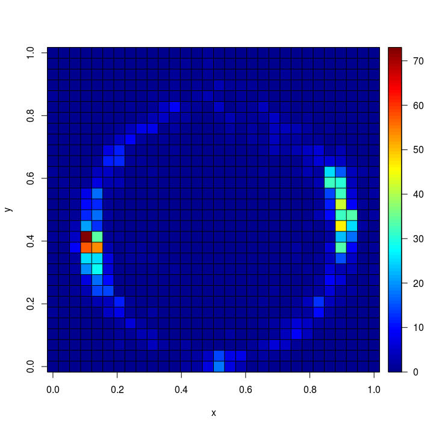

# Normalize skewed magnetometer values with GPU and CUDA-C
Blazingly fast rectangular to polar normalization of massive datasets of projected magnetometer values

## Install and compile
    sudo apt-get install libsqlite3-dev
    make

## Usage
    ./normalize ga_uppsala_2.sqlite3
    
## Normalized dataset
Dataset projected on the unity circle

